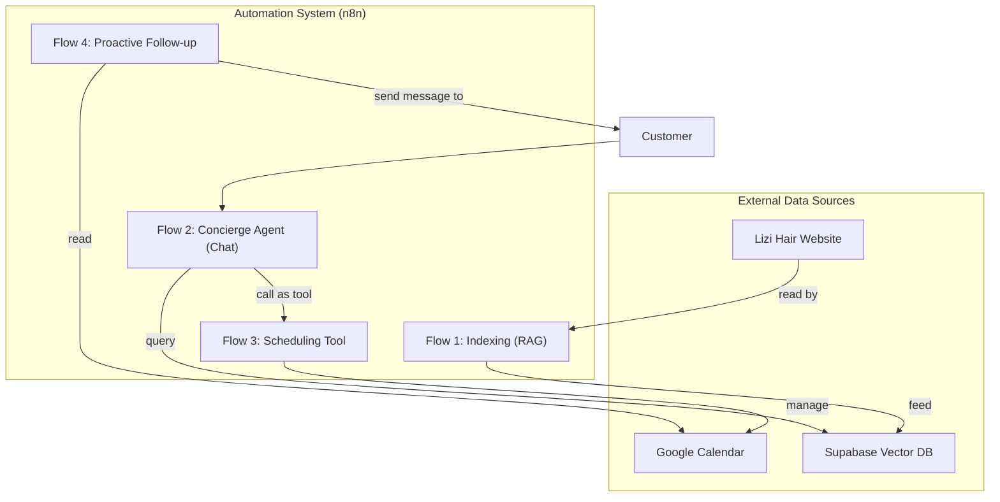

# n8n-arc
AI agent for complete automation of customer service, scheduling and marketing for Lizi Hair salon, built with n8n.

# 🤖 Digital Concierge Agent - Lizi Hair

## Project Overview

This repository contains the workflows and documentation for the Lizi Hair salon's intelligent automation system. The project implements a multifunctional AI agent that acts as a digital concierge, combining RAG (Search Augmented Generation) capabilities to provide accurate information and SDR (Sales Development Representative) capabilities to actively guide clients toward scheduling and loyalty.

## 🏛️ System Architecture

The system is built on a microservices architecture using n8n workflows, ensuring modularity and scalability.

## Main Features

 - 24/7 Intelligent Support: Answers questions about services, products, and schedules based on a knowledge base extracted from the official website.
 - Proactive Scheduling: Not only schedules appointments, but also qualifies the client, checks the schedule in real time, and offers the best options.
 - Soft Booking: Reserves a 5-minute appointment for the client to confirm, creating a premium scheduling experience.
 - Post-Service Follow-up: Contacts clients after the appointment to ask for feedback and suggest products, increasing loyalty and revenue.
 - Loyalty Campaigns: Automatically sends birthday vouchers and campaigns to reactivate inactive clients.

📂 Repository Structure
/workflows: Contains the JSON files for each n8n workflow.

1_Indexing_Pipeline.json
2_Concierge_Agent.json
3_Scheduling_Tool.json
4_Followup_Workflow.json
5_Reservation_Cleaner.json

🚀 How to Use

 - Database Setup: Follow the instructions in /docs/supabase_setup.md to create and configure your vector table in Supabase.
 - Import Flows: Import the JSON files from the /workflows folder to your n8n instance.
 - Configure Credentials: Add your credentials for Google Calendar, Supabase, OpenAI, and the WhatsApp sending service to the respective nodes.
 - Run Indexing: Run the 1_Indexing_Pipeline.json flow once to create the dataset with the website information.
 - Activate the Flows: Activate the remaining flows for the system to begin operating.

💻 Technologies Used

 - Automation Platform: n8n.io
 - AI and LLMs: OpenAI (GPT-4o-mini), Google (Gemini)
 - Vector Database: Supabase (with pg_vector extension)
 - Calendar: Google Calendar
 - Communication: WhatsApp API 
